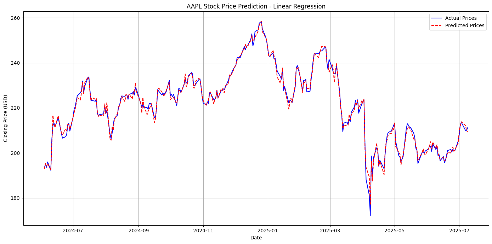
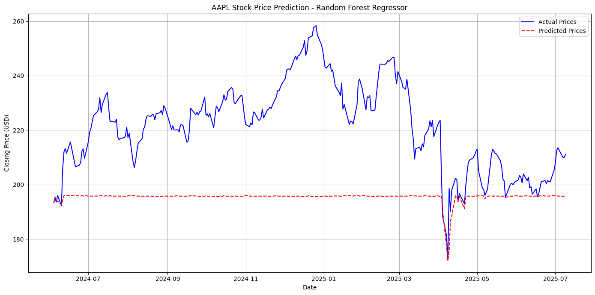

# 📈 AAPL Stock Price Prediction

This project predicts the closing stock price of Apple Inc. (AAPL) using historical stock data and two machine learning models: **Linear Regression** and **Random Forest Regressor**. It fetches real-time data using the `yfinance` API, preprocesses it, engineers relevant features, trains models, evaluates performance, and visualizes results.

---

## 🔧 Technologies Used

- Python 3.x
- yfinance
- pandas
- numpy
- scikit-learn
- matplotlib
- datetime

---

## 📁 Project Structure


---

## 🚀 How It Works

### 1. **Data Acquisition**
Fetches historical AAPL stock data from Yahoo Finance (from Jan 1, 2020 to today's date).

### 2. **Data Preprocessing & Feature Engineering**
- Handles missing values
- Creates lagged features (previous close, volume, high, low)
- Adds time-based features (day of week, month, year)
- Computes moving averages and volatility
- Scales data using MinMaxScaler

### 3. **Model Training & Evaluation**
Two models are trained and tested on an 80-20 time-based split:
- **Linear Regression**
- **Random Forest Regressor**

Performance Metrics:
- Mean Squared Error (MSE)
- Root Mean Squared Error (RMSE)
- R² Score

### 4. **Visualization**
Predicted vs actual closing prices are plotted to visualize model performance.

---

## 📊 Results Summary

| Model                   | MSE     | RMSE    | R² Score |
|------------------------|---------|---------|----------|
| **Linear Regression**  | 2.2001  | 1.4833  | 0.9910   |
| **Random Forest**      | 896.2710| 29.9378 | -2.6511  |

**🔍 Insight:**  
Linear Regression performs extremely well and closely follows the real stock prices.  
Random Forest fails to learn meaningful patterns—likely due to inadequate handling of temporal dependencies.

---

## 🖼 Sample Visualizations

### Linear Regression


### Random Forest Regressor


> *(Replace the above image paths with actual plot image paths in your repo)*

---

## 🧠 Key Takeaways

- Linear Regression can be surprisingly effective for short-term price prediction with well-engineered features.
- Random Forest, despite being powerful, may **underfit** in time-series tasks without proper feature crafting or temporal modeling.
- Time-based splitting is crucial to avoid **data leakage** in time-series forecasting.

---

## 🛠️ To Run the Project

### Step 1: Clone the repository
```bash
git clone https://github.com/Ojhaji0/stock-price-prediction.git
cd stock-price-prediction
